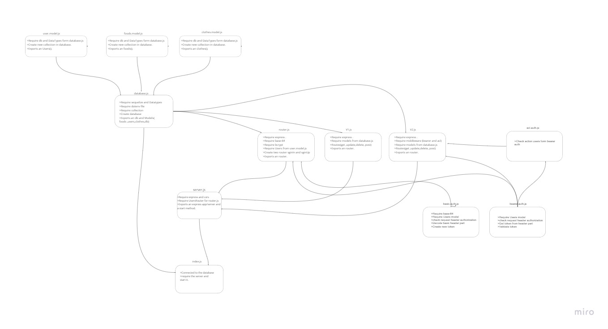

# auth-api

# Heroku link  
[Heroku link](https://obieda-auth-api.herokuapp.com/users)

# PR
[PR](https://github.com/Oubaida996/auth-api/pull/1)  

# Actions
[Action](https://github.com/Oubaida996/auth-api/actions)

/users get request    
 
{  

"id": 1,  

"userName": "mohamad",  

"pwd": "$2b$05$V1rpmgyvvmTpVgxvOp2myOwmDW97I8ziWp/yFdVFOKHCITutjS97K",  

"createdAt": "2022-03-09T13:56:46.954Z",  

"updatedAt": "2022-03-09T13:56:46.954Z"  

}

    

  /signUp  post request  

{  

    "userName": "test",
    "pwd": "test"  

} 

  /signIn  post request    (basic auth )  

{  

    user name :........  
    password  :........  

}

  /secretstuff  get request    (bearer auth )  

{  

    token : ...................  

}  

  /api/v1/foods 

{  

  foodName:   
  categoryName:  

} 

  
